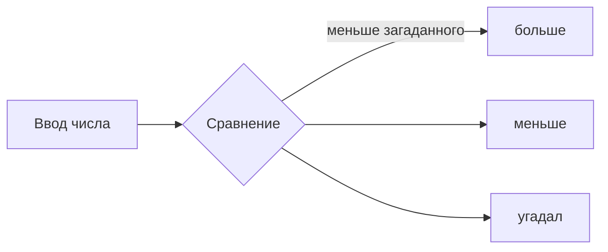

# Угадай число

Игра загадывает число, а вы угадываете: на каждую догадку она отвечает, больше загаданное или меньше.

> [!WARNING]
> Нужен Node.js 24.12 или новее.

## Как идёт партия

```mermaid
flowchart LR
    A[Ввод числа] --> B{Сравнение}
    B -->|меньше загаданного| C[больше]
    B --> D[меньше]
    B --> E[угадал]
```
